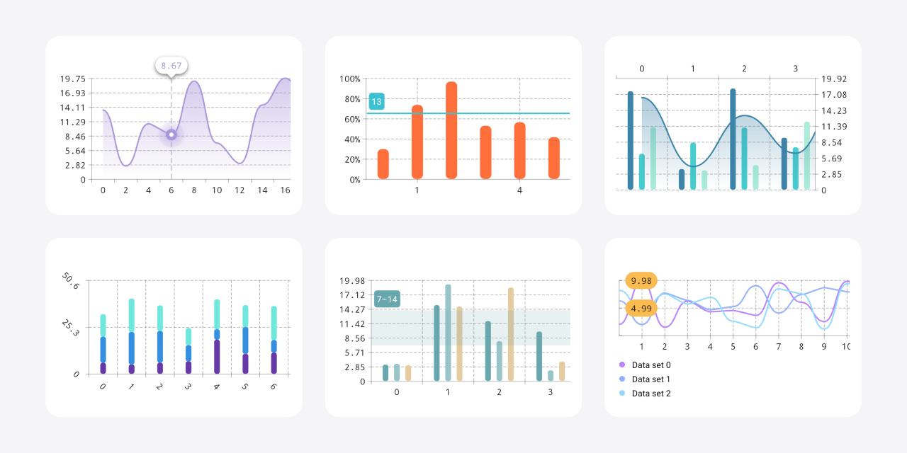

# Vico

Vico is a light and extensible chart library for Android. It’s compatible with both Jetpack Compose and the view system,
but its two main modules—`compose` and `views`—are independent.

There are three primary learning resources for Vico:

- [The wiki](https://patrykandpatrick.com/vico/wiki) includes
  [a setup guide](https://patrykandpatrick.com/vico/wiki/getting-started) and outlines Vico’s features and structure.
- [The sample app](https://github.com/patrykandpatrick/vico/tree/master/sample) demonstrates how to use Vico in Jetpack
  Compose and the view system. The charts showcased at the top of this document are implemented in the sample app.
- [The API reference](https://patrykandpatrick.com/vico/api) is a comprehensive manual for Vico’s API.
