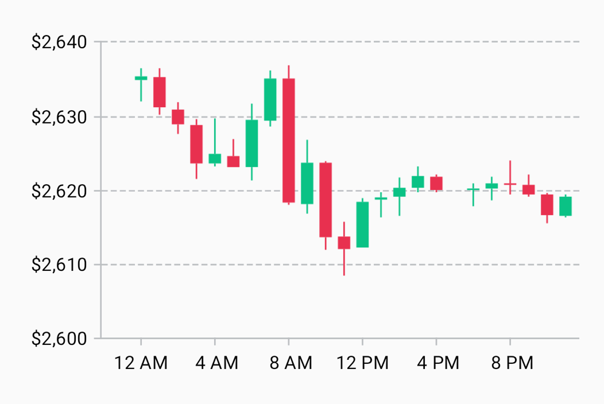

---
metaLinks:
  alternates:
    - >-
      https://app.gitbook.com/s/Wpa2ykTaKZoySxzNtySN/multiplatform/cartesian-charts/candlestickcartesianlayer
---

# CandlestickCartesianLayer

Use [`CandlestickCartesianLayer`][candlestick-cartesian-layer] to create candlestick charts. Instantiate it via [`rememberCandlestickCartesianLayer`][remember-candlestick-cartesian-layer].

Each candle’s style is defined by its corresponding [`Candle`][candle] instance. These are provided by [`CandleProvider`][candle-provider]:

* To style candles based on their absolute price changes (closing vs. opening), use [`absolute`][absolute]. This is commonly used for filled candles and provides corresponding defaults.
* To style candles based on both their absolute price changes (closing vs. opening) and their relative price changes (closing vs. previous closing), use [`absoluteRelative`][absolute-relative]. This is commonly used for hollow candles and provides corresponding defaults.
* For custom behavior, implement `CandleProvider`.

In `rememberCandlestickCartesianLayer`, you can set the minimum body height, change the candle spacing, and toggle wick scaling. For an example, see the [“Gold prices (12/30/2024)”][gold-prices-12-30-2024] sample chart.

<figure><figcaption></figcaption></figure>

## `Transaction.candlestickModel`

Candlestick layers use [`CandlestickCartesianLayerModel`][candlestick-cartesian-layer-model] instances. When using [`CartesianChartModelProducer`][cartesian-chart-model-producer], add them via [`candlestickModel`][candlestick-model]:

```kt
cartesianChartModelProducer.runTransaction {
    candlestickModel(
        x = listOf(1, 2, 3, 4),
        opening = listOf(2, 4, 6, 3),
        closing = listOf(4, 5, 3, 3),
        low = listOf(1, 4, 2, 2),
        high = listOf(5, 6, 7, 4),
    )
    // ...
}
```

`candlestickModel` also has an overload with no `x` parameter, which uses the indices of the prices as the _x_-values:

```kt
candlestickModel(
    opening = listOf(2, 4, 6, 3),
    closing = listOf(4, 5, 3, 3),
    low = listOf(1, 4, 2, 2),
    high = listOf(5, 6, 7, 4),
)
```

## Manual `CandlestickCartesianLayerModel` creation

When creating a [`CartesianChartModel`][cartesian-chart-model] instance directly, you can add a candlestick-layer model by using [`build`][build]:

```kt
CartesianChartModel(
    CandlestickCartesianLayerModel.build(
        x = listOf(1, 2, 3, 4),
        opening = listOf(2, 4, 6, 3),
        closing = listOf(4, 5, 3, 3),
        low = listOf(1, 4, 2, 2),
        high = listOf(5, 6, 7, 4),
    ),
    // ...
)
```

This function also has an overload with no `x` parameter:

```kt
CandlestickCartesianLayerModel.build(
    opening = listOf(2, 4, 6, 3),
    closing = listOf(4, 5, 3, 3),
    low = listOf(1, 4, 2, 2),
    high = listOf(5, 6, 7, 4),
)
```

[candlestick-cartesian-layer]: https://api.vico.patrykandpatrick.com/vico/compose/com.patrykandpatrick.vico.compose.cartesian.layer/-candlestick-cartesian-layer/
[remember-candlestick-cartesian-layer]: https://api.vico.patrykandpatrick.com/vico/compose/com.patrykandpatrick.vico.compose.cartesian.layer/remember-candlestick-cartesian-layer.html
[candle]: https://api.vico.patrykandpatrick.com/vico/compose/com.patrykandpatrick.vico.compose.cartesian.layer/-candlestick-cartesian-layer/-candle/
[candle-provider]: https://api.vico.patrykandpatrick.com/vico/compose/com.patrykandpatrick.vico.compose.cartesian.layer/-candlestick-cartesian-layer/-candle-provider/
[absolute]: https://api.vico.patrykandpatrick.com/vico/compose/com.patrykandpatrick.vico.compose.cartesian.layer/absolute.html
[absolute-relative]: https://api.vico.patrykandpatrick.com/vico/compose/com.patrykandpatrick.vico.compose.cartesian.layer/absolute-relative.html
[gold-prices-12-30-2024]: https://github.com/patrykandpatrick/vico/blob/stable/sample/charts/compose/src/commonMain/kotlin/com/patrykandpatrick/vico/sample/charts/compose/GoldPrices.kt
[candlestick-cartesian-layer-model]: https://api.vico.patrykandpatrick.com/vico/compose/com.patrykandpatrick.vico.compose.cartesian.data/-candlestick-cartesian-layer-model/
[cartesian-chart-model-producer]: https://api.vico.patrykandpatrick.com/vico/compose/com.patrykandpatrick.vico.compose.cartesian.data/-cartesian-chart-model-producer/
[candlestick-model]: https://api.vico.patrykandpatrick.com/vico/compose/com.patrykandpatrick.vico.compose.cartesian.data/candlestick-model.html
[cartesian-chart-model]: https://api.vico.patrykandpatrick.com/vico/compose/com.patrykandpatrick.vico.compose.cartesian.data/-cartesian-chart-model/
[build]: https://api.vico.patrykandpatrick.com/vico/compose/com.patrykandpatrick.vico.compose.cartesian.data/-candlestick-cartesian-layer-model/-companion/build.html
