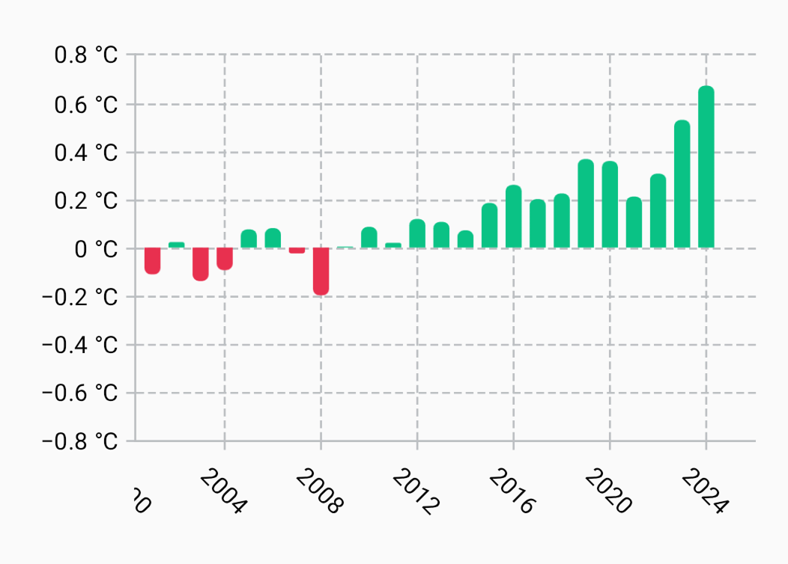
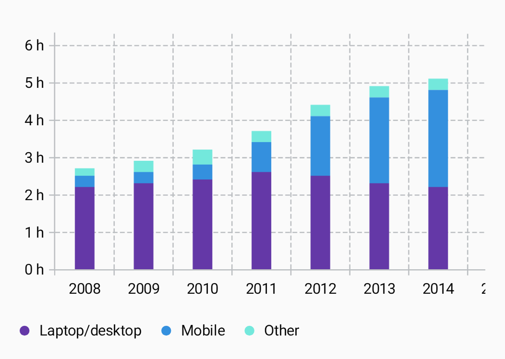

---
metaLinks:
  alternates:
    - >-
      https://app.gitbook.com/s/Wpa2ykTaKZoySxzNtySN/multiplatform/cartesian-charts/columncartesianlayer
---

# ColumnCartesianLayer

Use [`ColumnCartesianLayer`](https://api.vico.patrykandpatrick.com/vico/compose/com.patrykandpatrick.vico.compose.cartesian.layer/-column-cartesian-layer/) to create column charts. Instantiate it via [`rememberColumnCartesianLayer`](https://api.vico.patrykandpatrick.com/vico/compose/com.patrykandpatrick.vico.compose.cartesian.layer/remember-column-cartesian-layer).

Columns are drawn via [`LineComponent`](https://api.vico.patrykandpatrick.com/vico/compose/com.patrykandpatrick.vico.compose.common.component/-line-component/) instances provided by [`ColumnProvider`](https://api.vico.patrykandpatrick.com/vico/compose/com.patrykandpatrick.vico.compose.cartesian.layer/-column-cartesian-layer/-column-provider/). [`ColumnProvider.series`](https://api.vico.patrykandpatrick.com/vico/compose/com.patrykandpatrick.vico.compose.cartesian.layer/-column-cartesian-layer/-column-provider/-companion/series) creates a `ColumnProvider` instance that uses one `LineComponent` instance per series. You can create your own implementation for custom behavior, including styling columns individually based on their _y_-values, as in the [“Temperature anomalies (June)”](https://github.com/patrykandpatrick/vico/blob/stable/sample/charts/compose/src/commonMain/kotlin/com/patrykandpatrick/vico/sample/charts/compose/TemperatureAnomalies.kt) sample chart.

<figure><figcaption><p>The <a href="https://github.com/patrykandpatrick/vico/blob/stable/sample/charts/compose/src/commonMain/kotlin/com/patrykandpatrick/vico/sample/charts/compose/TemperatureAnomalies.kt">“Temperature anomalies (June)”</a> sample chart, which colors each column according to its <em>y</em>-value</p></figcaption></figure>

In `rememberColumnCartesianLayer`, you can also change column spacing. Data labels are supported. When multiple series are added, columns can be grouped horizontally or stacked. The [“Daily digital-media use (USA)”](https://github.com/patrykandpatrick/vico/blob/stable/sample/charts/compose/src/commonMain/kotlin/com/patrykandpatrick/vico/sample/charts/compose/DailyDigitalMediaUse.kt) sample chart uses stacking.

<figure><figcaption><p>The <a href="https://github.com/patrykandpatrick/vico/blob/stable/sample/charts/compose/src/commonMain/kotlin/com/patrykandpatrick/vico/sample/charts/compose/DailyDigitalMediaUse.kt">“Daily digital-media use (USA)”</a> sample chart, which stacks its column series</p></figcaption></figure>

## `Transaction.columnModel`

Column layers use [`ColumnCartesianLayerModel`](https://api.vico.patrykandpatrick.com/vico/compose/com.patrykandpatrick.vico.compose.cartesian.data/-column-cartesian-layer-model/) instances. When using [`CartesianChartModelProducer`](https://api.vico.patrykandpatrick.com/vico/compose/com.patrykandpatrick.vico.compose.cartesian.data/-cartesian-chart-model-producer/), add them via [`columnModel`](https://api.vico.patrykandpatrick.com/vico/compose/com.patrykandpatrick.vico.compose.cartesian.data/column-model):

```kt
cartesianChartModelProducer.runTransaction {
    columnModel {
        series(1, 8, 3, 7)
        series(y = listOf(6, 1, 9, 3))
        series(x = listOf(1, 2, 3, 4), y = listOf(2, 5, 3, 4))
    }
    // ...
}
```

Each [`series`](https://api.vico.patrykandpatrick.com/vico/compose/com.patrykandpatrick.vico.compose.cartesian.data/-column-cartesian-layer-model/-builder-scope/series) invocation adds a series to the `ColumnCartesianLayerModel` instance. Above, three series are added. `series` has three overloads (each of which accepts all `Number` subtypes):

* a `vararg` overload that takes _y_-values and uses their indices as the _x_-values
* an overload that takes a collection of _y_-values and uses their indices as the _x_-values
* an overload that takes a collection of _x_-values and a collection of _y_-values of the same size

## Manual `ColumnCartesianLayerModel` creation

When creating a [`CartesianChartModel`](https://api.vico.patrykandpatrick.com/vico/compose/com.patrykandpatrick.vico.compose.cartesian.data/-cartesian-chart-model/) instance directly, you can add a column-layer model by using [`build`](https://api.vico.patrykandpatrick.com/vico/compose/com.patrykandpatrick.vico.compose.cartesian.data/-column-cartesian-layer-model/-companion/build). This function gives you access to the same DSL that `columnModel` does.

```kt
CartesianChartModel(
    ColumnCartesianLayerModel.build {
        series(1, 8, 3, 7)
        series(y = listOf(6, 1, 9, 3))
        series(x = listOf(1, 2, 3, 4), y = listOf(2, 5, 3, 4))
    },
    // ...
)
```
