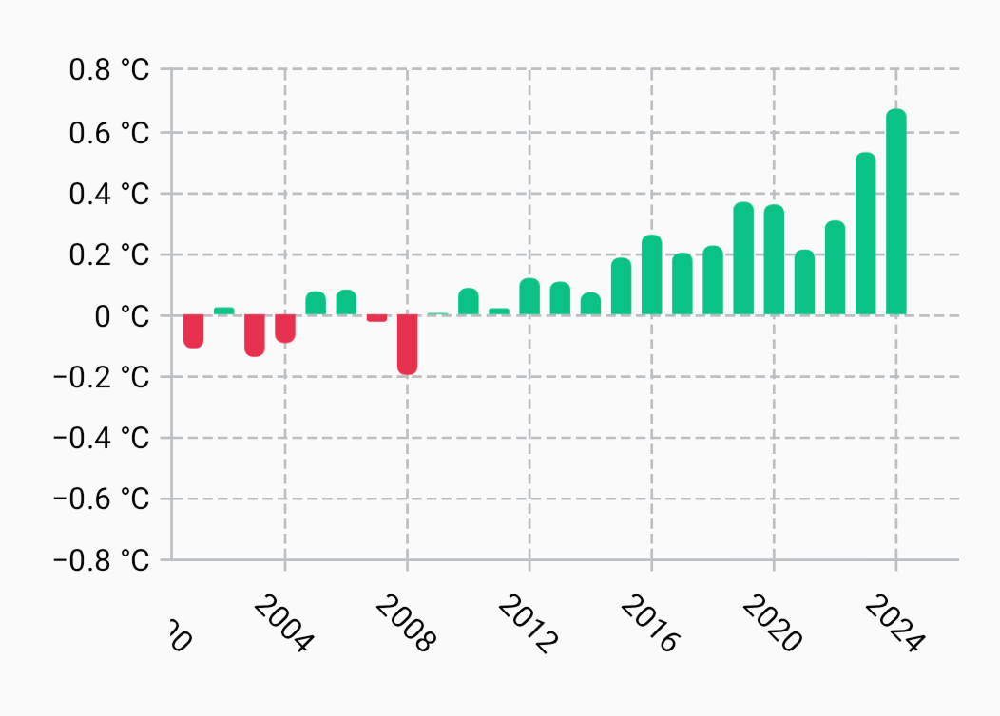
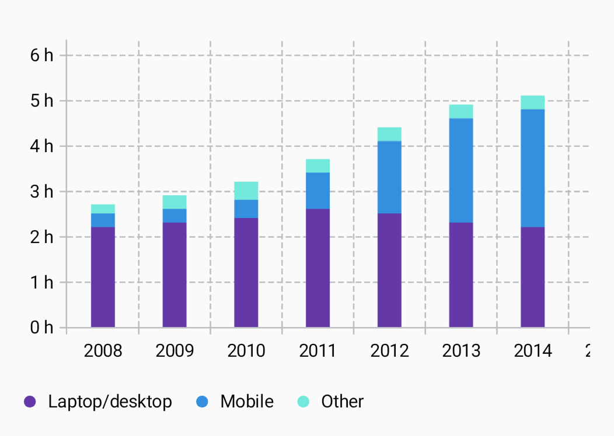

---
metaLinks:
  alternates:
    - >-
      https://app.gitbook.com/s/Wpa2ykTaKZoySxzNtySN/multiplatform/cartesian-charts/columncartesianlayer
---

# ColumnCartesianLayer

Use [`ColumnCartesianLayer`][column-cartesian-layer] to create column charts. Instantiate it via [`rememberColumnCartesianLayer`][remember-column-cartesian-layer].

Columns are drawn via [`LineComponent`][line-component] instances provided by [`ColumnProvider`][column-provider]. [`ColumnProvider.series`][column-provider-series] creates a `ColumnProvider` instance that uses one `LineComponent` instance per series. You can create your own implementation for custom behavior, including styling columns individually based on their _y_-values, as in the [“Temperature anomalies (June)”][temperature-anomalies-june] sample chart.

<figure><figcaption><p>The <a href="https://github.com/patrykandpatrick/vico/blob/stable/sample/shared/src/commonMain/kotlin/com/patrykandpatrick/vico/sample/charts/TemperatureAnomalies.kt">“Temperature anomalies (June)”</a> sample chart, which colors each column according to its <em>y</em>-value</p></figcaption></figure>

In `rememberColumnCartesianLayer`, you can also change column spacing. Data labels are supported. When multiple series are added, columns can be grouped horizontally or stacked. The [“Daily digital-media use (USA)”][daily-digital-media-use-usa] sample chart uses stacking.

<figure><figcaption><p>The <a href="https://github.com/patrykandpatrick/vico/blob/stable/sample/shared/src/commonMain/kotlin/com/patrykandpatrick/vico/sample/charts/DailyDigitalMediaUse.kt">“Daily digital-media use (USA)”</a> sample chart, which stacks its column series</p></figcaption></figure>

## Grouped stacking

Use [`ColumnCartesianLayer.MergeMode.GroupedStacked`][grouped-stacked] to place groups side by side and stack the series in each group. Its key selector receives the key supplied to [`series`][series] and returns a group key. Give each series a stable key so the selector does not depend on its position in the model.

Positive and negative values accumulate independently within each group: positive columns stack upward from zero and negative columns stack downward from zero. Axis labels remain independent of the merge mode. Configure them on [`HorizontalAxis.rememberBottom`][horizontal-axis-remember-bottom], for example with a value formatter for month names.

```kt
val months = listOf("Jan", "Feb", "Mar", "Apr")
val x = listOf<Number>(0, 1, 2, 3)

val layer =
  rememberColumnCartesianLayer(
    mergeMode = {
      ColumnCartesianLayer.MergeMode.GroupedStacked(
        groupKeySelector = { seriesKey -> if (seriesKey == "Income") "Income" else "Expenses" }
      )
    }
  )

val bottomAxis =
  HorizontalAxis.rememberBottom(
    valueFormatter = { _, value, _ ->
      value
        .takeIf { it.isFinite() && it == it.toInt().toDouble() }
        ?.let { months.getOrElse(it.toInt()) { "" } }
        ?: ""
    },
  )

cartesianChartModelProducer.runTransaction {
  columnModel {
    series(x = x, y = listOf(8, 9, 10, 11), key = "Income")
    series(x = x, y = listOf(3, 3, 4, 3), key = "House")
    series(x = x, y = listOf(2, 2, 1, 2), key = "Car")
    series(x = x, y = listOf(1, 2, 2, 2), key = "Food")
  }
}
```

## `Transaction.columnModel`

Column layers use [`ColumnCartesianLayerModel`][column-cartesian-layer-model] instances. When using [`CartesianChartModelProducer`][cartesian-chart-model-producer], add them via [`columnModel`][column-model]:

```kt
cartesianChartModelProducer.runTransaction {
    columnModel {
        series(1, 8, 3, 7)
        series(y = listOf(6, 1, 9, 3))
        series(x = listOf(1, 2, 3, 4), y = listOf(2, 5, 3, 4))
    }
    // ...
}
```

Each [`series`][series] invocation adds a series to the `ColumnCartesianLayerModel` instance. Above, three series are added. `series` has three overloads (each of which accepts all `Number` subtypes):

* a `vararg` overload that takes _y_-values and uses their indices as the _x_-values
* an overload that takes a collection of _y_-values and uses their indices as the _x_-values
* an overload that takes a collection of _x_-values and a collection of _y_-values of the same size

## Manual `ColumnCartesianLayerModel` creation

When creating a [`CartesianChartModel`][cartesian-chart-model] instance directly, you can add a column-layer model by using [`build`][build]. This function gives you access to the same DSL that `columnModel` does.

```kt
CartesianChartModel(
    ColumnCartesianLayerModel.build {
        series(1, 8, 3, 7)
        series(y = listOf(6, 1, 9, 3))
        series(x = listOf(1, 2, 3, 4), y = listOf(2, 5, 3, 4))
    },
    // ...
)
```

[column-cartesian-layer]: https://api.vico.patrykandpatrick.com/vico/compose/com.patrykandpatrick.vico.compose.cartesian.layer/-column-cartesian-layer/
[remember-column-cartesian-layer]: https://api.vico.patrykandpatrick.com/vico/compose/com.patrykandpatrick.vico.compose.cartesian.layer/remember-column-cartesian-layer.html
[line-component]: https://api.vico.patrykandpatrick.com/vico/compose/com.patrykandpatrick.vico.compose.common.component/-line-component/
[column-provider]: https://api.vico.patrykandpatrick.com/vico/compose/com.patrykandpatrick.vico.compose.cartesian.layer/-column-cartesian-layer/-column-provider/
[column-provider-series]: https://api.vico.patrykandpatrick.com/vico/compose/com.patrykandpatrick.vico.compose.cartesian.layer/-column-cartesian-layer/-column-provider/-companion/series.html
[temperature-anomalies-june]: https://github.com/patrykandpatrick/vico/blob/stable/sample/shared/src/commonMain/kotlin/com/patrykandpatrick/vico/sample/charts/TemperatureAnomalies.kt
[daily-digital-media-use-usa]: https://github.com/patrykandpatrick/vico/blob/stable/sample/shared/src/commonMain/kotlin/com/patrykandpatrick/vico/sample/charts/DailyDigitalMediaUse.kt
[column-cartesian-layer-model]: https://api.vico.patrykandpatrick.com/vico/compose/com.patrykandpatrick.vico.compose.cartesian.data/-column-cartesian-layer-model/
[cartesian-chart-model-producer]: https://api.vico.patrykandpatrick.com/vico/compose/com.patrykandpatrick.vico.compose.cartesian.data/-cartesian-chart-model-producer/
[column-model]: https://api.vico.patrykandpatrick.com/vico/compose/com.patrykandpatrick.vico.compose.cartesian.data/column-model.html
[series]: https://api.vico.patrykandpatrick.com/vico/compose/com.patrykandpatrick.vico.compose.cartesian.data/-column-cartesian-layer-model/-builder-scope/series.html
[cartesian-chart-model]: https://api.vico.patrykandpatrick.com/vico/compose/com.patrykandpatrick.vico.compose.cartesian.data/-cartesian-chart-model/
[build]: https://api.vico.patrykandpatrick.com/vico/compose/com.patrykandpatrick.vico.compose.cartesian.data/-column-cartesian-layer-model/-companion/build.html
[grouped-stacked]: https://api.vico.patrykandpatrick.com/vico/compose/com.patrykandpatrick.vico.compose.cartesian.layer/-column-cartesian-layer/-merge-mode/-grouped-stacked/
[horizontal-axis-remember-bottom]: https://api.vico.patrykandpatrick.com/vico/compose/com.patrykandpatrick.vico.compose.cartesian.axis/-horizontal-axis/-companion/remember-bottom.html
