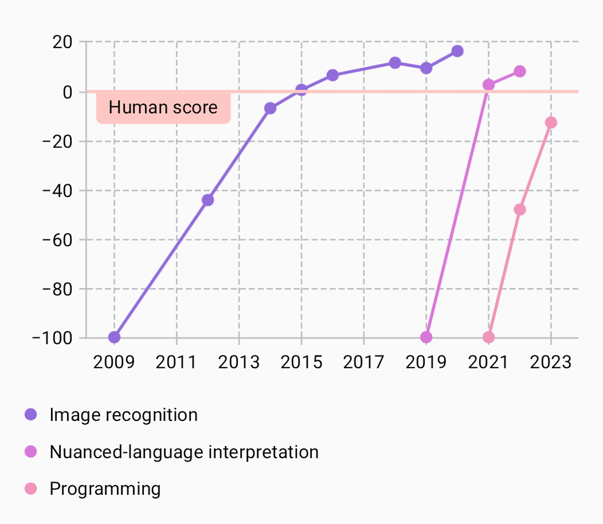

---
metaLinks:
  alternates:
    - >-
      https://app.gitbook.com/s/Wpa2ykTaKZoySxzNtySN/multiplatform/cartesian-charts/decoration
---

# Decoration

A decoration, represented by [`Decoration`][decoration], adds an additional layer of data to a chart. There are two built-in implementations—[`HorizontalLine`][horizontal-line] and [`HorizontalBox`][horizontal-box]—and you can add your own.

For an example, see the [“AI test scores”][ai-test-scores] sample chart.

<figure><figcaption>
The <a href="https://github.com/patrykandpatrick/vico/blob/stable/sample/charts/compose/src/commonMain/kotlin/com/patrykandpatrick/vico/sample/charts/compose/AITestScores.kt">“AI test scores”</a> sample chart, in which a <code>HorizontalLine</code> decoration marks a threshold
</figcaption></figure>

[decoration]: https://api.vico.patrykandpatrick.com/vico/compose/com.patrykandpatrick.vico.compose.cartesian.decoration/-decoration/
[horizontal-line]: https://api.vico.patrykandpatrick.com/vico/compose/com.patrykandpatrick.vico.compose.cartesian.decoration/-horizontal-line/
[horizontal-box]: https://api.vico.patrykandpatrick.com/vico/compose/com.patrykandpatrick.vico.compose.cartesian.decoration/-horizontal-box/
[ai-test-scores]: https://github.com/patrykandpatrick/vico/blob/stable/sample/charts/compose/src/commonMain/kotlin/com/patrykandpatrick/vico/sample/charts/compose/AITestScores.kt
