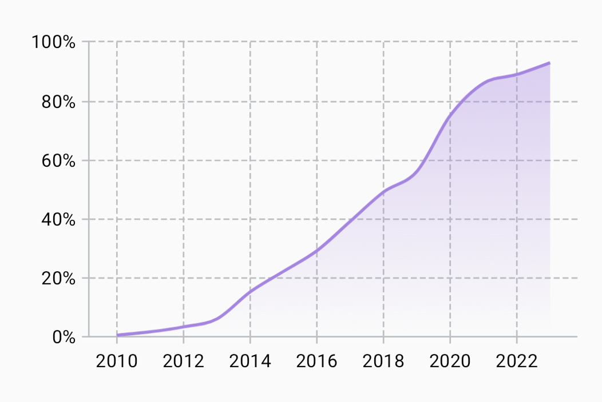

---
metaLinks:
  alternates:
    - >-
      https://app.gitbook.com/s/Wpa2ykTaKZoySxzNtySN/multiplatform/cartesian-charts/linecartesianlayer
---

# LineCartesianLayer

Use [`LineCartesianLayer`](https://api.vico.patrykandpatrick.com/vico/compose/com.patrykandpatrick.vico.compose.cartesian.layer/-line-cartesian-layer/) to create line charts. Instantiate it via [`rememberLineCartesianLayer`](https://api.vico.patrykandpatrick.com/vico/compose/com.patrykandpatrick.vico.compose.cartesian.layer/remember-line-cartesian-layer).

Each line is associated with a [`Line`](https://api.vico.patrykandpatrick.com/vico/compose/com.patrykandpatrick.vico.compose.cartesian.layer/-line-cartesian-layer/-line/) instance. Create these via [`rememberLine`](https://api.vico.patrykandpatrick.com/vico/compose/com.patrykandpatrick.vico.compose.cartesian.layer/remember-line). These are provided by [`LineProvider`](https://api.vico.patrykandpatrick.com/vico/compose/com.patrykandpatrick.vico.compose.cartesian.layer/-line-cartesian-layer/-line-provider/). A base implementation of this interface can be instantiated via [`LineProvider.series`](https://api.vico.patrykandpatrick.com/vico/compose/com.patrykandpatrick.vico.compose.cartesian.layer/-line-cartesian-layer/-line-provider/-companion/series). You can customize line fills, backgrounds, shapes, and other properties. You can also add data labels, points, and interpolation.

## `LineStroke`

Line strokes are customized via [`LineStroke`](https://api.vico.patrykandpatrick.com/vico/compose/com.patrykandpatrick.vico.compose.cartesian.layer/-line-cartesian-layer/-line-stroke/), which has two implementations:

* [`Continuous`](https://api.vico.patrykandpatrick.com/vico/compose/com.patrykandpatrick.vico.compose.cartesian.layer/-line-cartesian-layer/-line-stroke/-continuous/)
* [`Dashed`](https://api.vico.patrykandpatrick.com/vico/compose/com.patrykandpatrick.vico.compose.cartesian.layer/-line-cartesian-layer/-line-stroke/-dashed/)

## `LineFill` and `AreaFill`

Line fills are customized via [`LineFill`](https://api.vico.patrykandpatrick.com/vico/compose/com.patrykandpatrick.vico.compose.cartesian.layer/-line-cartesian-layer/-line-fill/), which has two factory functions:

* [`single`](https://api.vico.patrykandpatrick.com/vico/compose/com.patrykandpatrick.vico.compose.cartesian.layer/-line-cartesian-layer/-line-fill/-companion/single)
* [`double`](https://api.vico.patrykandpatrick.com/vico/compose/com.patrykandpatrick.vico.compose.cartesian.layer/-line-cartesian-layer/-line-fill/-companion/double)

Area fills, which are optional, are customized via [`AreaFill`](https://api.vico.patrykandpatrick.com/vico/compose/com.patrykandpatrick.vico.compose.cartesian.layer/-line-cartesian-layer/-area-fill/). This has similar factory functions to `LineFill`:

* [`single`](https://api.vico.patrykandpatrick.com/vico/compose/com.patrykandpatrick.vico.compose.cartesian.layer/-line-cartesian-layer/-area-fill/-companion/single)
* [`double`](https://api.vico.patrykandpatrick.com/vico/compose/com.patrykandpatrick.vico.compose.cartesian.layer/-line-cartesian-layer/-area-fill/-companion/double)

These cover most use cases. You can use both colors and brushes, and you can apply split styling—enabling you to create a line that’s green for positive values and red for negative values, for instance. You can, however, also create your own `LineFill` and `AreaFill` implementations.

[`LineFill.colorScale`](https://api.vico.patrykandpatrick.com/vico/compose/com.patrykandpatrick.vico.compose.cartesian.layer/-line-cartesian-layer/-line-fill/-companion/color-scale) and [`AreaFill.colorScale`](https://api.vico.patrykandpatrick.com/vico/compose/com.patrykandpatrick.vico.compose.cartesian.layer/-line-cartesian-layer/-area-fill/-companion/color-scale) provide another option. These APIs let you define multi-stop styling against the value scale instead of splitting at a single threshold.

For an example of an area fill, see the [“Electric-car sales (Norway)”](https://github.com/patrykandpatrick/vico/blob/stable/sample/charts/compose/src/commonMain/kotlin/com/patrykandpatrick/vico/sample/charts/compose/ElectricCarSales.kt) sample chart.

<figure><figcaption><p>The <a href="https://github.com/patrykandpatrick/vico/blob/stable/sample/charts/compose/src/commonMain/kotlin/com/patrykandpatrick/vico/sample/charts/compose/ElectricCarSales.kt">“Electric-car sales (Norway)”</a> sample chart, which combines an area fill with <code>catmullRom</code> interpolation</p></figcaption></figure>

## `Interpolator`

Use [`Interpolator`](https://api.vico.patrykandpatrick.com/vico/compose/com.patrykandpatrick.vico.compose.cartesian.layer/-line-cartesian-layer/-interpolator/) to define how a line passes through its points. Three built-in implementations are available:

* [`Sharp`](https://api.vico.patrykandpatrick.com/vico/compose/com.patrykandpatrick.vico.compose.cartesian.layer/-line-cartesian-layer/-interpolator/-companion/-sharp)
* [`cubic`](https://api.vico.patrykandpatrick.com/vico/compose/com.patrykandpatrick.vico.compose.cartesian.layer/-line-cartesian-layer/-interpolator/-companion/cubic)
* [`catmullRom`](https://api.vico.patrykandpatrick.com/vico/compose/com.patrykandpatrick.vico.compose.cartesian.layer/-line-cartesian-layer/-interpolator/-companion/catmull-rom)

The first uses straight line segments. The second uses cubic Bézier curves. The third passes through all points and keeps collinear segments straight. The [“Electric-car sales (Norway)”](https://github.com/patrykandpatrick/vico/blob/stable/sample/charts/compose/src/commonMain/kotlin/com/patrykandpatrick/vico/sample/charts/compose/ElectricCarSales.kt) sample chart uses `catmullRom`.

## `PointProvider`

To add points, use [`PointProvider`](https://api.vico.patrykandpatrick.com/vico/compose/com.patrykandpatrick.vico.compose.cartesian.layer/-line-cartesian-layer/-point-provider/). [`PointProvider.single`](https://api.vico.patrykandpatrick.com/vico/compose/com.patrykandpatrick.vico.compose.cartesian.layer/-line-cartesian-layer/-point-provider/-companion/single) instantiates a base implementation that adds a point for each entry and uses a shared point style. Once again, custom implementations can be created. A common use case for this is styling points individually based on their _y_-values. For an example, see the [“AI test scores”](https://github.com/patrykandpatrick/vico/blob/stable/sample/charts/compose/src/commonMain/kotlin/com/patrykandpatrick/vico/sample/charts/compose/AITestScores.kt) sample chart.

## `Transaction.lineModel`

Line layers use [`LineCartesianLayerModel`](https://api.vico.patrykandpatrick.com/vico/compose/com.patrykandpatrick.vico.compose.cartesian.data/-line-cartesian-layer-model/) instances. When using [`CartesianChartModelProducer`](https://api.vico.patrykandpatrick.com/vico/compose/com.patrykandpatrick.vico.compose.cartesian.data/-cartesian-chart-model-producer/), add them via [`lineModel`](https://api.vico.patrykandpatrick.com/vico/compose/com.patrykandpatrick.vico.compose.cartesian.data/line-model):

```kt
cartesianChartModelProducer.runTransaction {
    lineModel {
        series(1, 8, 3, 7)
        series(y = listOf(6, 1, 9, 3))
        series(x = listOf(1, 2, 3, 4), y = listOf(2, 5, 3, 4))
    }
    // ...
}
```

Each [`series`](https://api.vico.patrykandpatrick.com/vico/compose/com.patrykandpatrick.vico.compose.cartesian.data/-line-cartesian-layer-model/-builder-scope/series) invocation adds a series to the `LineCartesianLayerModel` instance. Above, three series are added. `series` has three overloads (each of which accepts all `Number` subtypes):

* a `vararg` overload that takes _y_-values and uses their indices as the _x_-values
* an overload that takes a collection of _y_-values and uses their indices as the _x_-values
* an overload that takes a collection of _x_-values and a collection of _y_-values of the same size

## Manual `LineCartesianLayerModel` creation

When creating a [`CartesianChartModel`](https://api.vico.patrykandpatrick.com/vico/compose/com.patrykandpatrick.vico.compose.cartesian.data/-cartesian-chart-model/) instance directly, you can add a line-layer model by using [`build`](https://api.vico.patrykandpatrick.com/vico/compose/com.patrykandpatrick.vico.compose.cartesian.data/-line-cartesian-layer-model/-companion/build). This function gives you access to the same DSL that `lineModel` does.

```kt
CartesianChartModel(
    LineCartesianLayerModel.build {
        series(1, 8, 3, 7)
        series(y = listOf(6, 1, 9, 3))
        series(x = listOf(1, 2, 3, 4), y = listOf(2, 5, 3, 4))
    },
    // ...
)
```
