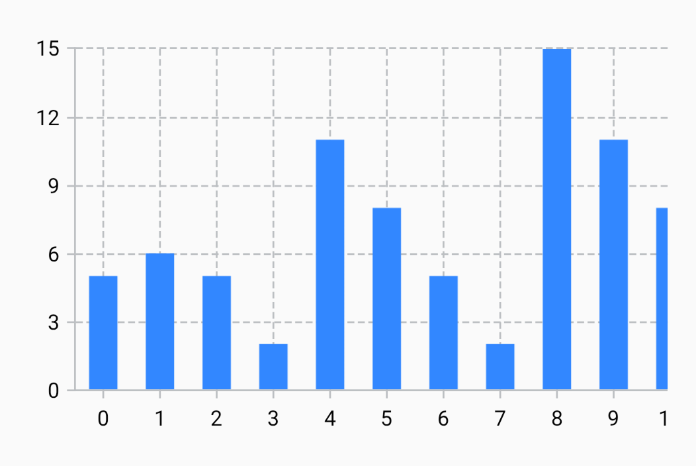
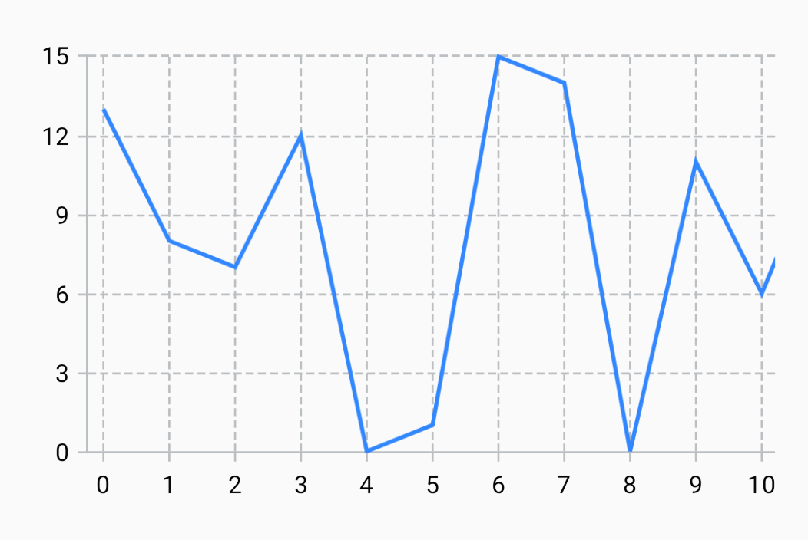
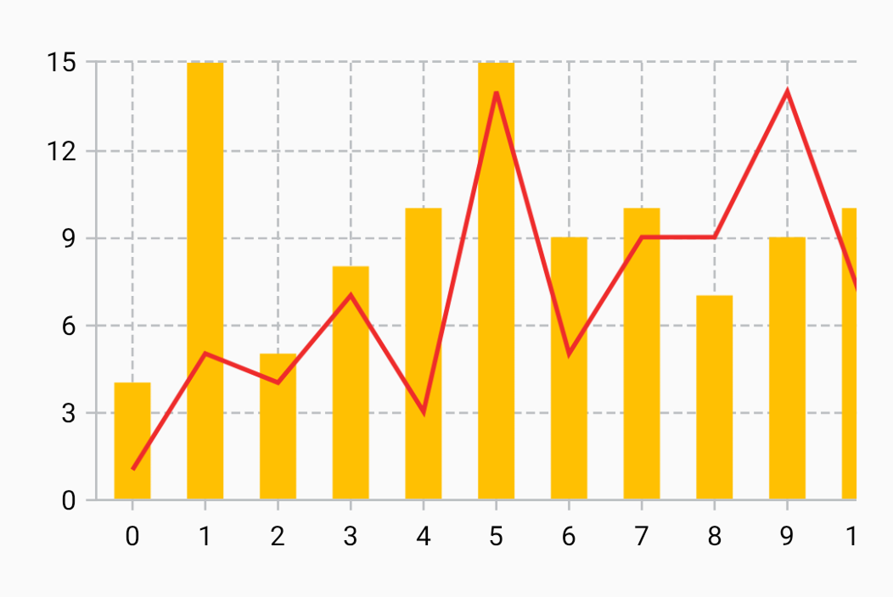

---
metaLinks:
  alternates:
    - >-
      https://app.gitbook.com/s/Wpa2ykTaKZoySxzNtySN/multiplatform/cartesian-charts/starter-examples
---

# Starter examples

## Column chart

The following has been adapted from the [“Basic column chart”](https://github.com/patrykandpatrick/vico/blob/stable/sample/charts/compose/src/commonMain/kotlin/com/patrykandpatrick/vico/sample/charts/compose/BasicColumnChart.kt) sample chart.

```kt
val modelProducer = remember { CartesianChartModelProducer() }
LaunchedEffect(Unit) {
    modelProducer.runTransaction {
        columnModel { series(5, 6, 5, 2, 11, 8, 5, 2, 15, 11, 8, 13, 12, 10, 2, 7) }
    }
}
CartesianChartHost(
    rememberCartesianChart(
        rememberColumnCartesianLayer(),
        startAxis = VerticalAxis.rememberStart(),
        bottomAxis = HorizontalAxis.rememberBottom(),
    ),
    modelProducer,
)
```

<figure><figcaption></figcaption></figure>

## Line chart

The following has been adapted from the [“Basic line chart”](https://github.com/patrykandpatrick/vico/blob/stable/sample/charts/compose/src/commonMain/kotlin/com/patrykandpatrick/vico/sample/charts/compose/BasicLineChart.kt) sample chart.

```kt
val modelProducer = remember { CartesianChartModelProducer() }
LaunchedEffect(Unit) {
    modelProducer.runTransaction {
        lineModel { series(13, 8, 7, 12, 0, 1, 15, 14, 0, 11, 6, 12, 0, 11, 12, 11) }
    }
}
CartesianChartHost(
    rememberCartesianChart(
        rememberLineCartesianLayer(),
        startAxis = VerticalAxis.rememberStart(),
        bottomAxis = HorizontalAxis.rememberBottom(),
    ),
    modelProducer,
)
```

<figure><figcaption></figcaption></figure>

## Combo chart

The following has been adapted from the [“Basic combo chart”](https://github.com/patrykandpatrick/vico/blob/stable/sample/charts/compose/src/commonMain/kotlin/com/patrykandpatrick/vico/sample/charts/compose/BasicComboChart.kt) sample chart.

```kt
val modelProducer = remember { CartesianChartModelProducer() }
LaunchedEffect(Unit) {
    modelProducer.runTransaction {
        columnModel { series(4, 15, 5, 8, 10, 15, 9, 10, 7, 9, 10, 12, 2, 9, 5, 14) }
        lineModel { series(1, 5, 4, 7, 3, 14, 5, 9, 9, 14, 7, 13, 14, 4, 10, 12) }
    }
}
CartesianChartHost(
    rememberCartesianChart(
        rememberColumnCartesianLayer(
            ColumnCartesianLayer.ColumnProvider.series(
                rememberLineComponent(Fill(Color(0xffffc002)), 16.dp)
            )
        ),
        rememberLineCartesianLayer(
            LineCartesianLayer.LineProvider.series(
                LineCartesianLayer.Line(
                    LineCartesianLayer.LineFill.single(Fill(Color(0xffee2b2b)))
                )
            )
        ),
        startAxis = VerticalAxis.rememberStart(),
        bottomAxis = HorizontalAxis.rememberBottom(),
    ),
    modelProducer,
)
```

<figure><figcaption></figcaption></figure>

## More

For more examples, refer to [the sample app](../learning-resources.md#sample-app).
