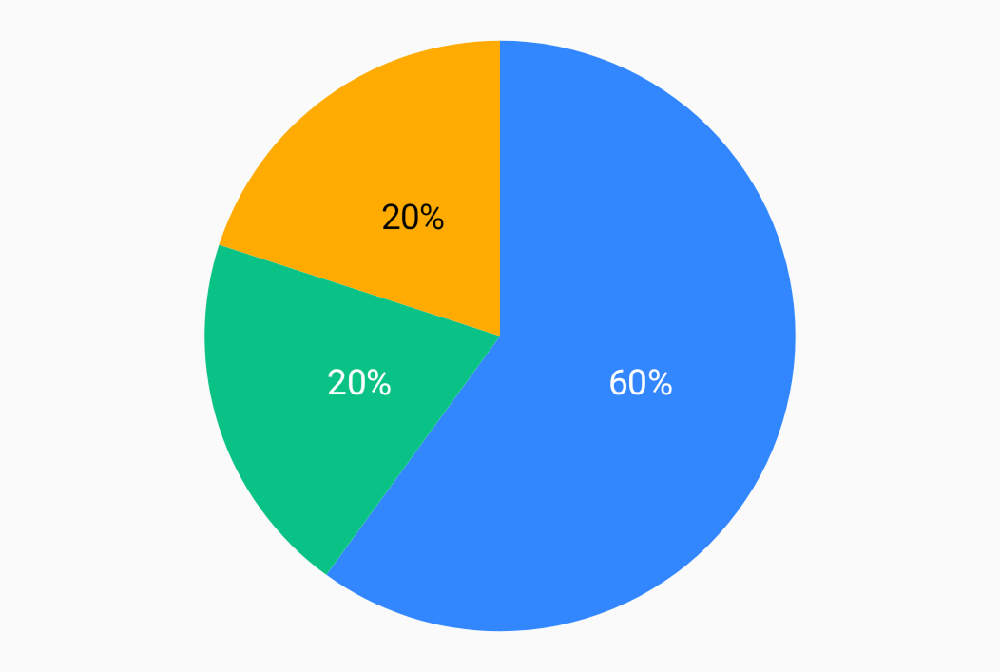

# PieChart

[`PieChart`][pie-chart] draws a pie chart.

## Creation

Instantiate `PieChart` via [`rememberPieChart`][remember-pie-chart].

```kt
val chart = rememberPieChart(/* ... */)
```

`PieChart` accepts a [`SliceProvider`][slice-provider] instance, which supplies [`Slice`][slice] instances for successive entries. Use [`SliceProvider.series`][slice-provider-series] for the standard repeating-series setup.

Each pie-slice style can define fill, stroke, an offset from the center, and an optional [`SliceLabel`][slice-label]. There are two built-in label types:

* [`Inside`][inside]
* [`Outside`][outside]

Use [`PieValueFormatter`][pie-value-formatter] to format slice labels.

You can also customize slice spacing, the start angle, and the inner and outer sizes. A nonzero inner size produces a donut chart.

For an example, see the [“Basic pie chart”][basic-pie-chart] sample chart.

<figure><figcaption></figcaption></figure>

[pie-chart]: https://api.vico.patrykandpatrick.com/vico/compose/com.patrykandpatrick.vico.compose.pie/-pie-chart/
[remember-pie-chart]: https://api.vico.patrykandpatrick.com/vico/compose/com.patrykandpatrick.vico.compose.pie/remember-pie-chart.html
[slice-provider]: https://api.vico.patrykandpatrick.com/vico/compose/com.patrykandpatrick.vico.compose.pie/-pie-chart/-slice-provider/
[slice]: https://api.vico.patrykandpatrick.com/vico/compose/com.patrykandpatrick.vico.compose.pie/-pie-chart/-slice/
[slice-provider-series]: https://api.vico.patrykandpatrick.com/vico/compose/com.patrykandpatrick.vico.compose.pie/-pie-chart/-slice-provider/-companion/series.html
[slice-label]: https://api.vico.patrykandpatrick.com/vico/compose/com.patrykandpatrick.vico.compose.pie/-pie-chart/-slice-label/
[inside]: https://api.vico.patrykandpatrick.com/vico/compose/com.patrykandpatrick.vico.compose.pie/-pie-chart/-slice-label/-inside/
[outside]: https://api.vico.patrykandpatrick.com/vico/compose/com.patrykandpatrick.vico.compose.pie/-pie-chart/-slice-label/-outside/
[pie-value-formatter]: https://api.vico.patrykandpatrick.com/vico/compose/com.patrykandpatrick.vico.compose.pie.data/-pie-value-formatter/
[basic-pie-chart]: https://github.com/patrykandpatrick/vico/blob/stable/sample/charts/compose/src/commonMain/kotlin/com/patrykandpatrick/vico/sample/charts/compose/BasicPieChart.kt
