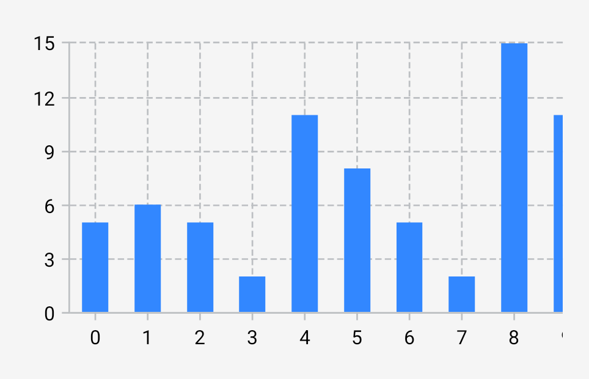

---
metaLinks:
  alternates:
    - >-
      https://app.gitbook.com/s/Wpa2ykTaKZoySxzNtySN/android/views/cartesian-charts/starter-examples
---

# Starter examples

## Column chart

The following has been adapted from the [“Basic column chart”](https://github.com/patrykandpatrick/vico/blob/stable/sample/charts/views/src/main/kotlin/com/patrykandpatrick/vico/sample/charts/views/BasicColumnChart.kt) sample chart.

```xml
<style name="ChartStyle">
    <item name="layers">column</item>
    <item name="showBottomAxis">true</item>
    <item name="showStartAxis">true</item>
</style>
```

```xml
<com.patrykandpatrick.vico.views.cartesian.CartesianChartView
    android:id="@+id/chart_view"
    android:layout_width="match_parent"
    android:layout_height="wrap_content"
    app:chartStyle="@style/ChartStyle" />
```

At the top level of the `Activity`:

```kt
val modelProducer = CartesianChartModelProducer()
```

In `onCreate`:

```kt
chartView.modelProducer = modelProducer
lifecycleScope.launch {
    modelProducer.runTransaction {
        columnSeries { series(5, 6, 5, 2, 11, 8, 5, 2, 15, 11, 8, 13, 12, 10, 2, 7) }
    }
}
```

<figure><figcaption></figcaption></figure>

## Line chart

The following has been adapted from the [“Basic line chart”](https://github.com/patrykandpatrick/vico/blob/stable/sample/charts/views/src/main/kotlin/com/patrykandpatrick/vico/sample/charts/views/BasicLineChart.kt) sample chart.

```xml
<style name="ChartStyle">
    <item name="layers">line</item>
    <item name="showBottomAxis">true</item>
    <item name="showStartAxis">true</item>
</style>
```

```xml
<com.patrykandpatrick.vico.views.cartesian.CartesianChartView
    android:id="@+id/chart_view"
    android:layout_width="match_parent"
    android:layout_height="wrap_content"
    app:chartStyle="@style/ChartStyle" />
```

At the top level of the `Activity`:

```kt
val modelProducer = CartesianChartModelProducer()
```

In `onCreate`:

```kt
chartView.modelProducer = modelProducer
lifecycleScope.launch {
    modelProducer.runTransaction {
        lineSeries { series(13, 8, 7, 12, 0, 1, 15, 14, 0, 11, 6, 12, 0, 11, 12, 11) }
    }
}
```

<figure><figcaption></figcaption></figure>

## More

For more examples, refer to [the sample app](../../learning-resources.md#sample-app).
