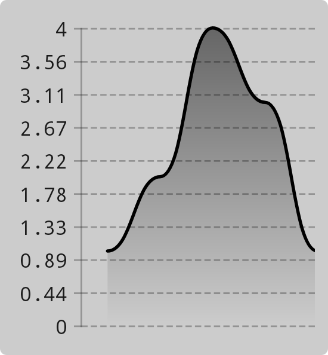
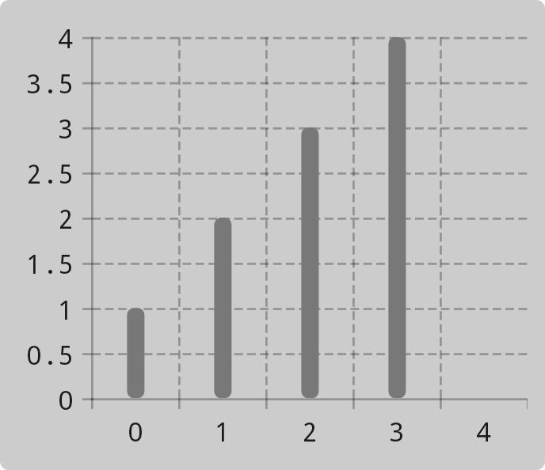
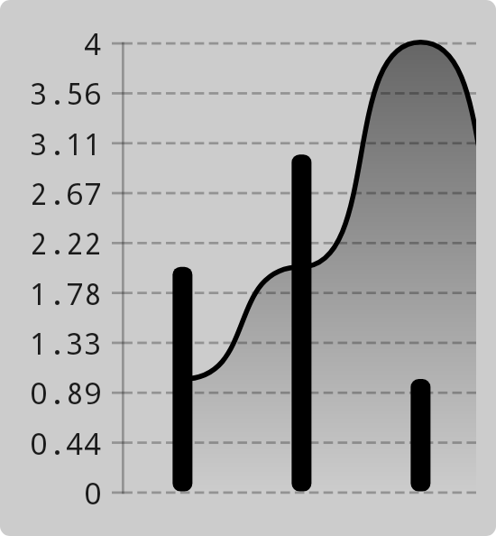

Chart types define how data is presented on a chart. All chart types offer customization options, which are described later on in this wiki.
You can create your own chart types by extending [`BaseChart`](https://patrykandpatryk.com/vico/api/vico/core/com.patrykandpatryk.vico.core.chart/-base-chart/?query=abstract%20class%20BaseChart%3Cin%20Model%20:%20ChartEntryModel%3E%20:%20Chart%3CModel%3E%20,%20BoundsAware) or [`Chart`](https://patrykandpatryk.com/vico/api/vico/core/com.patrykandpatryk.vico.core.chart/-chart/).
Note that the way data is represented on a chart depends on the chart type, but the chart type doesn’t control elements such as markers and axes.

## Line charts

Line charts display data as a continuous line or, in the case of [`ChartEntryModel`](https://patrykandpatryk.com/vico/api/vico/core/com.patrykandpatryk.vico.core.entry/-chart-entry-model/)s
containing multiple datasets, multiple lines. Each line in a line chart can be individually customized (see [`LineSpec`](https://patrykandpatryk.com/vico/api/vico/core/com.patrykandpatryk.vico.core.chart.line/-line-chart/-line-spec/)).
Line charts also support data labels, which are displayed for each key point on the line (that is, for each y-axis value defined in the line’s corresponding dataset).



## Column charts

Column charts display data in the form of columns. For [`ChartEntryModel`](https://patrykandpatryk.com/vico/api/vico/core/com.patrykandpatryk.vico.core.entry/-chart-entry-model/)s
containing multiple datasets, multiple columns are displayed per chart segment, in which case they can be grouped (displayed next to each other) or stacked (placed on top of one another).
Like line charts, column charts support data labels. These are displayed near the top edge of each column.



## Composed charts

Composed charts comprise any number of charts. These can be of different types. The charts in a composed chart can be independently scaled, which can be configured via `targetVerticalAxisPosition` parameter of [`LineChart`](https://patrykandpatryk.com/vico/api/vico/core/com.patrykandpatryk.vico.core.chart.line/-line-chart/) and [`ColumnChart`](https://patrykandpatryk.com/vico/api/vico/core/com.patrykandpatryk.vico.core.chart.column/-column-chart/).



## Setting the type of a chart

You can set the type of a chart as follows:

- In the view system, use the `chart` attribute of [`ChartView`](https://patrykandpatryk.com/vico/api/vico/view/com.patrykandpatryk.vico.view.chart/-chart-view/?query=class%20ChartView%C2%A0constructor(context:%20Context,%20attrs:%20AttributeSet?,%20defStyleAttr:%20Int)%20:%20BaseChartView%3CChartEntryModel%3E) (possible values: `line`, `column`, and `stackedColumn`). To create a composed chart, use [`ComposedChartView`](https://patrykandpatryk.com/vico/api/vico/view/com.patrykandpatryk.vico.view.chart/-composed-chart-view/?query=class%20ComposedChartView%C2%A0constructor(context:%20Context,%20attrs:%20AttributeSet?,%20defStyleAttr:%20Int)%20:%20BaseChartView%3CComposedChartEntryModel%3CChartEntryModel%3E%3E) and its `charts` attribute (example: `line|column`). To provide a custom `Chart` implementation, use the `chart` field of [`BaseChartView`](https://patrykandpatryk.com/vico/api/vico/view/com.patrykandpatryk.vico.view.chart/-base-chart-view/?query=abstract%20class%20BaseChartView%3CModel%20:%20ChartEntryModel%3E%20:%20View) (which is extended by `ChartView` and `ComposedChartView`).

- In Jetpack Compose, use the `chart` parameter of the [`Chart`](https://patrykandpatryk.com/vico/api/vico/compose/com.patrykandpatryk.vico.compose.chart/-chart) composable. You can use the [`lineChart`](https://patrykandpatryk.com/vico/api/vico/compose/com.patrykandpatryk.vico.compose.chart.line/line-chart) or [`columnChart`](https://patrykandpatryk.com/vico/api/vico/compose/com.patrykandpatryk.vico.compose.chart.column/column-chart) function, or provide a custom `Chart` implementation. To create a composed chart, use the `+` operator:

    ```kotlin
    lineChart() + columnChart()
    ```

## Examples

See [the sample app](https://github.com/patrykandpatryk/vico/tree/master/sample) for multiple examples in both Jetpack Compose and the view system.
