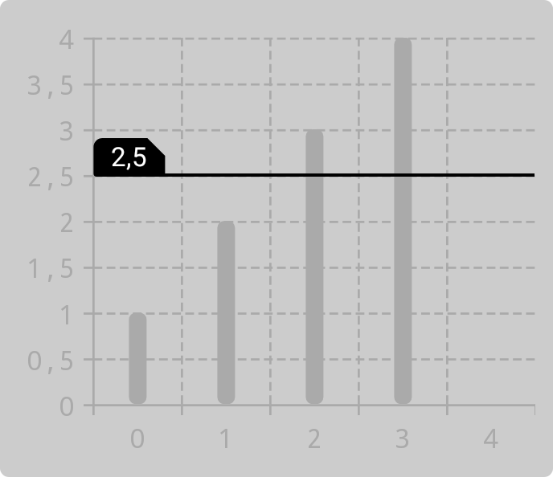
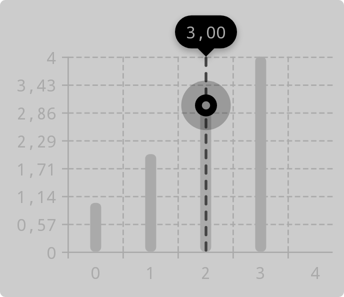

In addition to customizing charts, you can add decorations and markers to them.

## Decorations

Decorations display an additional layer of data. They can be added to a chart as follows:

- In Jetpack Compose, use the `decorations` parameter of [`columnChart`](https://patrykandpatrick.com/vico/api/vico/compose/com.patrykandpatrick.vico.compose.chart.column/column-chart) and [`lineChart`](https://patrykandpatrick.com/vico/api/vico/compose/com.patrykandpatrick.vico.compose.chart.line/line-chart).
- In the view system, use the `addDecoration`, `addDecorations`, `setDecorations`, `removeDecoration`, and `removeDecorations` functions. These are accessible via the `chart` field of [`BaseChartView`](https://patrykandpatrick.com/vico/api/vico/views/com.patrykandpatrick.vico.views.chart/-base-chart-view/) (which is extended by [`ChartView`](https://patrykandpatrick.com/vico/api/vico/views/com.patrykandpatrick.vico.views.chart/-chart-view/) and [`ComposedChartView`](https://patrykandpatrick.com/vico/api/vico/views/com.patrykandpatrick.vico.views.chart/-composed-chart-view/)).

### Threshold lines

Threshold lines are horizontal lines or boxes that highlight a specific value or range of values. You can use them to mark averages, target values, and so on. To create a threshold line, use the [`ThresholdLine`](https://patrykandpatrick.com/vico/api/vico/core/com.patrykandpatrick.vico.core.chart.decoration/-threshold-line/) class. It has two constructors: one for a threshold line highlighting a single value, and another one for a threshold line highlighting a range of values.

Some examples:

- a threshold line highlighting a range

    ```kotlin
    ThresholdLine(
        thresholdRange = 2f..3f,
        lineComponent = ShapeComponent(
            color = Color.BLACK,
            strokeWidthDp = 2f,
            dynamicShader = ComponentShader(
                ShapeComponent(shape = Shapes.pillShape, color = Color.DKGRAY),
                componentSizeDp = 4f,
            ),
        ),
        labelComponent = textComponent(Color.Black).setPadding(horizontal = 8f),
    )
    ```

    

- a threshold line highlighting a single value

    ```kotlin
    ThresholdLine(
        thresholdValue = 2.5f,
        lineComponent = ShapeComponent(
            color = Color.BLACK,
            shape = Shapes.roundedCornerShape(bottomLeftPercent = 100),
        ),
        labelComponent = textComponent {
            color = Color.WHITE
            background = ShapeComponent(
                shape = CorneredShape(
                    topLeft = Corner.Relative(
                        percentage = 25,
                        cornerTreatment = RoundedCornerTreatment,
                    ),
                    topRight = Corner.Relative(
                        percentage = 50,
                        cornerTreatment = CutCornerTreatment,
                    ),
                ),
                color = Color.BLACK,
            )
        }.setPadding(horizontal = 8f),
        minimumLineThicknessDp = 2f,
    )
    ```

    

## Markers

Markers highlight the _y_ value corresponding to a specific value on the x-axis. They can be shown when a chart is touched, or you can make them persistent. To create a marker, use the [`MarkerComponent`](https://patrykandpatrick.com/vico/api/vico/core/com.patrykandpatrick.vico.core.component.marker/-marker-component/) class or create your own implementation of the `Marker` interface. A marker can be added to a chart as follows:

- In Jetpack Compose, use the `marker` parameter of the `Chart` composable to add a marker displayed when a chart is touched, and use the `persistentMarkers` parameter of `columnChart` and `lineChart` to add persistent markers.
- In the view system, use use the `marker` field of `BaseChartView` to add a marker displayed when a chart is touched, and use the `addPersistentMarker`, `setPersistentMarkers`, and `removePersistentMarker` functions to add and remove persistent markers. These functions are accessible via the `chart` field of `BaseChartView` (which is extended by `ChartView` and `ComposedChartView`).

To listen to marker visibility changes, use [`MarkerVisibilityChangeListener`](https://patrykandpatrick.com/vico/api/vico/core/com.patrykandpatrick.vico.core.component.marker/-marker-visibility-change-listener/):

- In Jetpack Compose, use the `markerVisibilityChangeListener` parameter of the [`Chart`](https://patrykandpatrick.com/vico/api/vico/compose/com.patrykandpatrick.vico.compose.chart/-chart) composable.
- In the view system, use the `markerVisibilityChangeListener` field of [`BaseChartView`](https://patrykandpatrick.com/vico/api/vico/views/com.patrykandpatrick.vico.views.chart/-base-chart-view/).

Below is an example of how a marker can be created. Also see [`getMarker` in the sample app](https://github.com/patrykandpatrick/vico/blob/master/sample/src/main/java/com/patrykandpatrick/vico/sample/component/Marker.kt#L38).

```kotlin
val labelBackgroundShape = MarkerCorneredShape(all = Corner.FullyRounded)

val label = textComponent {
    color = Color.WHITE
    padding = dimensionsOf(horizontalDp = 8f, verticalDp = 4f)
    typeface = Typeface.MONOSPACE
    background = ShapeComponent(shape = labelBackgroundShape)
        .setShadow(
            color = Color.BLACK.copyColor(alpha = 0.3f),
            radius = SHADOW_RADIUS,
            dy = SHADOW_DY,
            applyElevationOverlay = true,
        )
}

val indicator = OverlayingComponent(
    outer = ShapeComponent(shape = pillShape, color = Color.BLACK.copyColor(alpha = 0.25f)),
    innerPaddingAllDp = 10f,
    inner = OverlayingComponent(
        outer = ShapeComponent(shape = pillShape),
        inner = ShapeComponent(shape = pillShape, color = Color.GRAY),
        innerPaddingAllDp = 5f,
    ),
)

val guideline = LineComponent(
    color = guidelineColor,
    thicknessDp = 2f,
    shape = DashedShape(shape = pillShape, dashLengthDp = 8f, gapLengthDp = 4f),
)

return object : MarkerComponent(
    label = label,
    indicator = indicator,
    guideline = guideline,
) {
    init {
        indicatorSizeDp = INDICATOR_SIZE_DP
    }

    override fun getInsets(context: MeasureContext, outInsets: Insets) = with(context) {
        outInsets.top = label.getHeight(this) + labelBackgroundShape.tickSizeDp.pixels +
            SHADOW_RADIUS.pixels * SHADOW_RADIUS_TO_PX_MULTIPLIER - SHADOW_DY.pixels
    }
}
```


