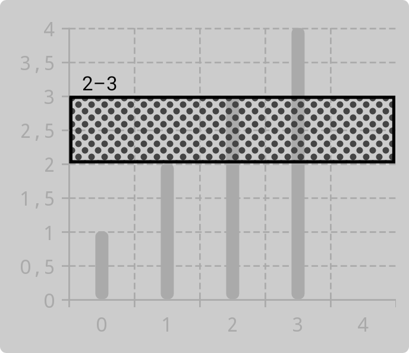
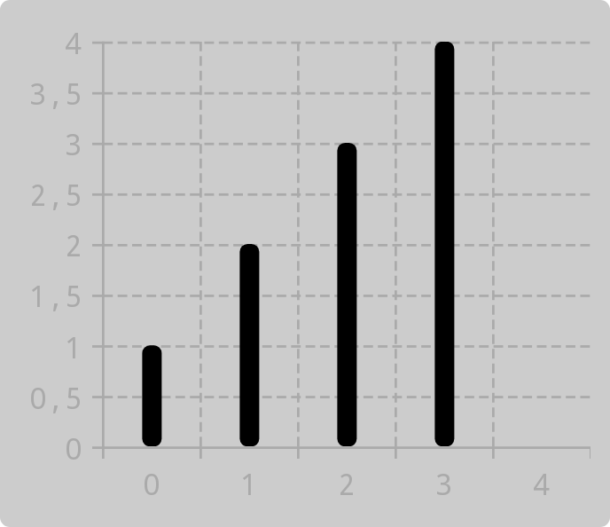
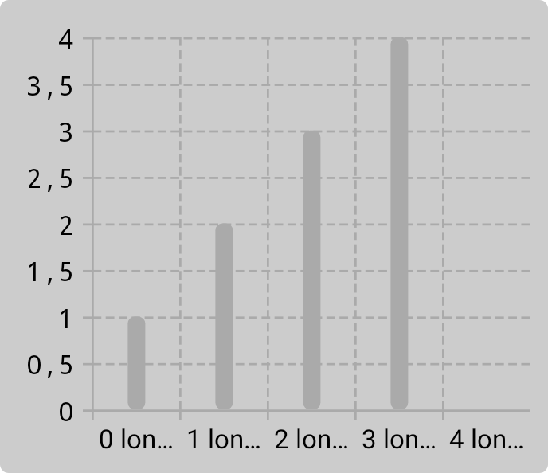
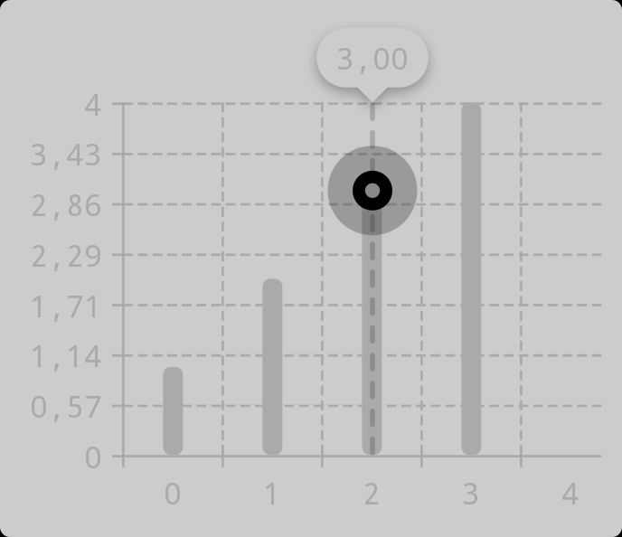

`Component` is the basic building block for nearly every part of Vico. It is used to draw content (e.g., a shape) in a given rectangle.

## `ShapeComponent`

`ShapeComponent` is a subclass of `Component` that draws a [`Shape`](/customization/shapes). The `Shape` can have a specific solid color, a stroke, or a [`DynamicShader`](https://patrykandpatrick.com/vico/api/vico/core/com.patrykandpatrick.vico.core.component.shape.shader/-dynamic-shader/?query=fun%20interface%20DynamicShader). For all available parameters, [see the documentation](https://patrykandpatrick.com/vico/api/vico/core/com.patrykandpatrick.vico.core.component.shape/-shape-component/-shape-component).

```kotlin
ShapeComponent(
    color = Color.BLACK,
    dynamicShader = ComponentShader(
        ShapeComponent(shape = Shapes.pillShape, color = Color.DKGRAY),
        componentSizeDp = 4f,
    ),
    strokeWidthDp = 2f,
    strokeColor = Color.BLACK,
)
```



## `LineComponent`

`LineComponent` is an extension of `ShapeComponent` that allows for specifying a fixed thickness of the drawn line. It is used, for example, to draw columns in [`ColumnChart`](https://patrykandpatrick.com/vico/api/vico/compose/com.patrykandpatrick.vico.compose.style/-chart-style/-column-chart/), and axis lines, ticks, and guidelines in [`Axis`](https://patrykandpatrick.com/vico/api/vico/core/com.patrykandpatrick.vico.core.axis/-axis/).

```kotlin
LineComponent(
    color = Color.BLACK,
    thicknessDp = 8f,
    shape = Shapes.roundedCornerShape(
        allPercent = 40,
    ),
)
```



## `TextComponent`

`TextComponent` renders text on Android’s `Canvas`. It is used for elements such as axis labels. `TextComponent` supports automatic line breaks, rotation, backgrounds, margins, padding, and more. For all available parameters, [see the documentation](https://patrykandpatrick.com/vico/api/vico/core/com.patrykandpatrick.vico.core.component.text/-text-component/?query=open%20class%20TextComponent%20:%20Padding,%20Margins).

```kotlin
buildTextComponent {
    color = Color.BLACK
    textSizeSp = 12f
    typeface = Typeface.MONOSPACE
    ellipsize = TextUtils.TruncateAt.END
}
```



The `textComponent` DSL is the quickest way to create a `TextComponent`, but you can also use [the `Builder` class](https://patrykandpatrick.com/vico/api/vico/core/com.patrykandpatrick.vico.core.component.text/-text-component/-builder/?query=class%20Builder).

## `OverlayingComponent`

`OverlayingComponent` overlays one component with another one and allows for specifying the padding between the two components. This enables the creation of complex UI elements. For all parameters of `OverlayingComponent`, [see the documentation](https://patrykandpatrick.com/vico/api/vico/core/com.patrykandpatrick.vico.core.component/-overlaying-component/?query=class%20OverlayingComponent(outer:%20Component,%20inner:%20Component,%20innerPaddingStartDp:%20Float,%20innerPaddingTopDp:%20Float,%20innerPaddingEndDp:%20Float,%20innerPaddingBottomDp:%20Float)%20:%20Component).

The above `OverlayingComponent` can be created as follows:
```kotlin
OverlayingComponent(
    outer = ShapeComponent(shape = pillShape, color = Color.BLACK.copyColor(alpha = 0.25f)),
    innerPaddingAllDp = 10f,
    inner = OverlayingComponent(
        outer = ShapeComponent(shape = pillShape, color = Color.BLACK),
        inner = ShapeComponent(shape = pillShape, color = Color.GRAY),
        innerPaddingAllDp = 5f,
    ),
)
```


