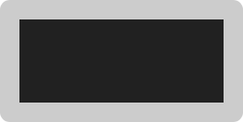
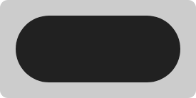
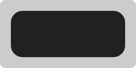
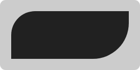
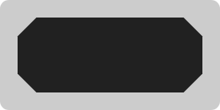
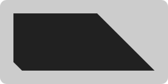
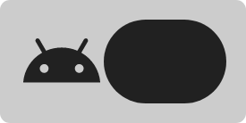
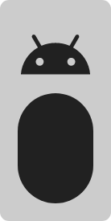
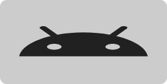
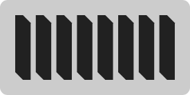

A [`Shape`](https://github.com/patrykandpatrick/vico/blob/master/vico/core/src/main/java/com/patrykandpatrick/vico/core/component/shape/Shape.kt) defines the appearance of a [`ShapeComponent`](https://github.com/patrykandpatrick/vico/blob/master/vico/core/src/main/java/com/patrykandpatrick/vico/core/component/shape/ShapeComponent.kt).  Most of the predefined `Shape` implementations are accessible via the `Shapes` object.

## Rectangle

This is the simplest kind of `Shape`. It displays a rectangle with sharp edges.

```kotlin
Shapes.rectShape
```



## Pill

A pill is a rectangle with all corners fully rounded.

```kotlin
Shapes.pillShape
```



## Rounded-corner shape

This shape type displays a rectangle with its corners rounded by the specified radii. Examples:

- a shared corner radius

    ```kotlin
    Shapes.roundedCornerShape(allPercent = 25)
    ```

    

- different corner radii for each corner

    ```kotlin
    Shapes.roundedCornerShape(topLeftPercent = 50, bottomRightPercent = 75)
    ```

    

## Cut-corner shape

Displays a rectangle with its corners cut by the specified sizes. Examples:

- a common cut size

    ```kotlin
    Shapes.cutCornerShape(allPercent = 25)
    ```

    

- different cut sizes for each corner

    ```kotlin
    Shapes.cutCornerShape(topRightPercent = 100, bottomLeftPercent = 15)
    ```

    

## Drawable shape

`Drawable`s can be converted to `Shape`s. The built-in converter function can:

1. keep the `Drawable`’s aspect ratio to prevent it from being stretched,

2. apply a tint equal to the parent `ShapeComponent`’s color, and

3. use another `Shape` to fill in the remaining space if the `Drawable` can’t fill all of the available space.

Examples:

- with `keepAspectRatio` and `otherShape`

    ```kotlin
    Shapes.drawableShape(
        drawable = getDrawable(id = R.drawable.ic_baseline_android_24),
        keepAspectRatio = true,
        otherShape = Shapes.pillShape,
    )
    ```

    

    

- without `keepAspectRatio`

    ```kotlin
    Shapes.drawableShape(getDrawable(id = R.drawable.ic_baseline_android_24))
    ```

    

## Dashed shape

`DashedShape` draws a dashed line along a path by interchangeably drawing a provided shape and leaving a gap. It is used for the default axis guidelines, among other things. For all available parameters, [see the documentation](https://patrykandpatrick.com/vico/api/vico/core/com.patrykandpatrick.vico.core.component.shape/-dashed-shape/?query=class%20DashedShape(shape:%20Shape,%20dashLengthDp:%20Float,%20gapLengthDp:%20Float,%20fitStrategy:%20DashedShape.FitStrategy)%20:%20Shape).

```kotlin
Shapes.dashedShape(
    shape = Shapes.cutCornerShape(topRightPercent = 50, bottomLeftPercent = 50),
    dashLength = 24.dp,
    gapLength = 8.dp,
)
```

